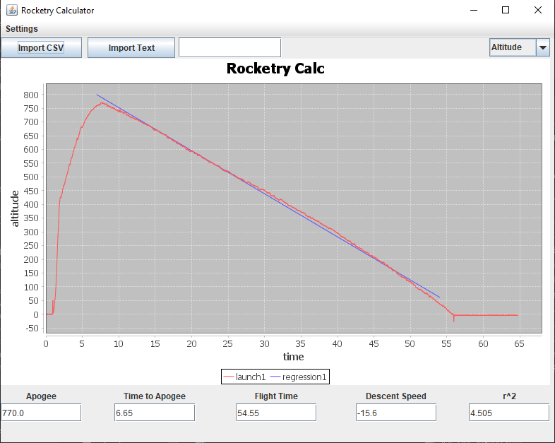

# RocketryCalculator
## What is this project?

Ingraham High School(my alma mater) competes in a competition called TARC(Team America Rocket Competition), which is a precision-based rocketry competition where the goal is to launch a rocket which meets a set of specifications as close as possible. These specifications could include the altitude at which the rocket flies, the spot where the rocket lands, or how long the rocket stays in the air. To hone the rockets, they run practice flights which generate substantial amounts of data. This data currently needs to be processed manually. This project automates that process, and includes specific analysis features that can help the club. It interprets data directly from the rocket and instantaneously processes it into a human-readable graph as well as calculating several critical values which are key to evaluating the launch and future optimizations - which were before calculated manually and on the spot. Written in Java/Swing.

## Example

Here, I've imported in data from a launch. First, it cleans the data and graphs altitude vs time. as well as producing the equation for the linear regression of the parachute fall. Then, it calculates a set of other important values at the bottom. Finally, you can change what it graphs with the dropdown menu at the top.

## Instructions
Download and run RocketryCalculator.jar, and import in any Apogee Rockets model data(should be default formatted in .csv). raw.csv is provided as an example.
